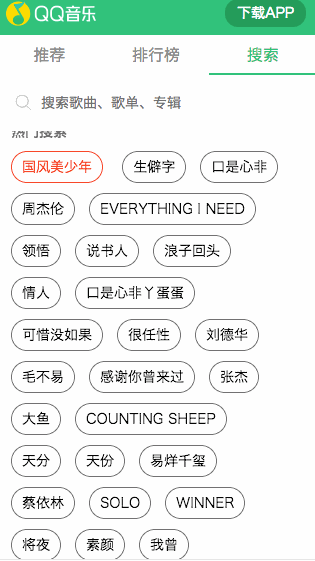
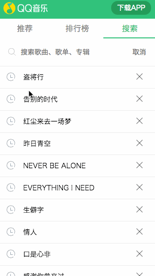

# 🔥 基于Vue2.0 + nuxt 高仿qq音乐的单页面项目

> 这个是使用了[Nuxt.js](https://nuxtjs.org).框架来做的qq音乐单页面项目
> 启动项目时，还需要启动另一个项目[middleware](https://github.com/wuzaofeng/middleware)充当中间件请求qq音乐接口
> 在开发的过程中，可能会没发现到一些特别的问题，有什么建议和问题，欢迎大牛们在[Issues](https://github.com/wuzaofeng/qq-music/issues)提出更加好的方案。

## 功能
- [x]  推荐模块
- [x]  推荐模块 - 轮播图
- [x]  推荐模块 - 电台
- [x]  推荐模块 - 热门歌单
- [x]  推荐模块 - 热门歌单 - 音乐播放
- [x]  排行榜模块 - 列表
- [x]  排行榜模块 - 详情
- [x]  搜索模块 - 热门搜索
- [x]  搜索模块 - 查询列表
- [x]  搜索模块 - 历史记录

## 目录结构
```
- api                   音乐请求的接口
    - api.js                接口
    - axios.js              封装的请求接口
    - type.js               接口地址
- assets                静态文件
    - config.js         公共配置
    - iconfont.js       阿里巴巴图标
    - utils.js          公共方法
- components            公用组件
- layouts              布局文件
- pages
    - song          
        -_id.vue        热门歌单详情✌️
    - top
        -_id.vue        排行榜详情✌️
    - index.vue         默认跳转✌️
    - ranking.vue       排行榜✌️
    - recommend.vue     推荐✌️（默认跳到的页面）
    - search.vue        搜索✌️
- scss                  样式表
- static                静态文件
```

##视图展示
##### 首页 (推荐) 模板


##### 推荐模板-详情✌️


##### 排行榜模板✌️


##### 搜索模板-热门搜索✌️



##### 搜索模板-历史记录✌️



##### 搜索模板-搜索✌️


## 其他
``` bash
# install dependencies
$ npm install

# serve with hot reload at localhost:3000
$ npm run dev
```

